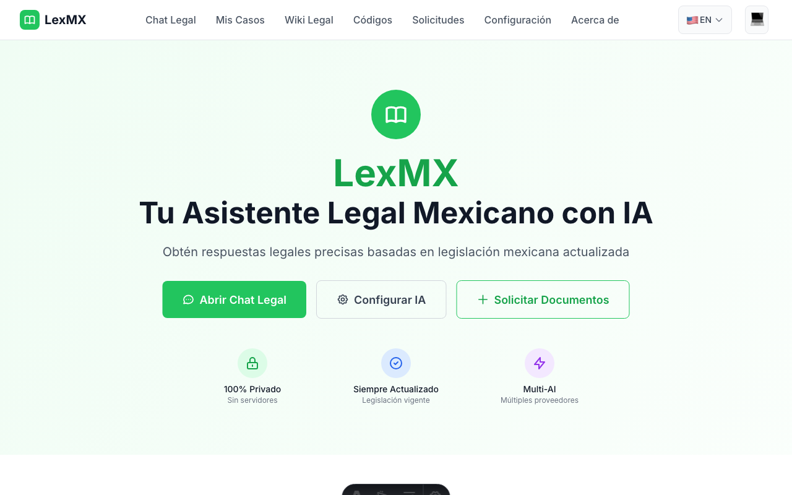
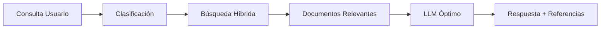

# LexMX 🇲🇽⚖️

> **Tu asistente legal inteligente para México**

LexMX es un asistente legal basado en IA que combina el corpus completo de la legislación mexicana con tecnología RAG (Retrieval Augmented Generation) para proporcionar respuestas legales precisas y contextualizadas. Completamente estático, desplegado en GitHub Pages, y optimizado para privacidad y costos.

[](https://github.com/ArtemioPadilla/LexMX/actions)
[](https://opensource.org/licenses/MIT)
[](https://astro.build/)
[](https://www.typescriptlang.org/)

## 🎥 Demo

<div align="center">
  <a href="https://ArtemioPadilla.github.io/LexMX">
    <picture>
      <source srcset="docs/demo/lexmx-demo.gif" type="image/gif">
      
    </picture>
  </a>
  
  **[🚀 Probar Demo en Vivo](https://ArtemioPadilla.github.io/LexMX)** | **[📹 Ver Demo Completo](docs/demo/lexmx-demo.gif)** | **[📺 Ver Video MP4](docs/demo/lexmx-demo.mp4)**
  
  *Asistente legal con IA • Múltiples proveedores LLM • Corpus legal mexicano completo*
</div>

## 🌟 Características principales

### 📁 **Gestión de Casos Legales** *(NUEVO)*
- Sistema completo de workspaces para casos legales
- Biblioteca de documentos con soporte para PDF, DOCX, imágenes
- Análisis selectivo - elige qué documentos analizar
- Detección de contradicciones e información faltante
- Generador de argumentos legales y listas de verificación
- Timeline de casos con seguimiento de deadlines

### 🔬 **RAG Avanzado y Configuración** *(NUEVO)*
- Chunking contextual que preserva la estructura legal
- Panel de configuración avanzado para usuarios expertos
- Control granular del tamaño de chunks (128-2048 tokens)
- Múltiples algoritmos de recuperación (híbrido, semántico, keyword)
- Modo desarrollador con métricas detalladas y plan de ejecución
- Visualización del pipeline RAG completo

### 🎯 **Consultas legales inteligentes**
- Búsqueda híbrida (semántica + keywords) en legislación mexicana
- Respuestas contextualizadas con referencias específicas a artículos
- Soporte para múltiples áreas del derecho (civil, penal, laboral, fiscal, etc.)

### 🤖 **Multi-LLM con optimización de costos**
- Integración con OpenAI, Claude, Gemini y AWS Bedrock
- Routing inteligente según tipo de consulta
- Reducción de costos hasta 90% mediante cache y optimizaciones

### 🔒 **Privacidad y seguridad**
- Tokens API encriptados client-side (AES-256)
- Procesamiento local sin envío de datos a servidores
- Cumplimiento con LFPDPPP (Ley mexicana de protección de datos)

### ⚡ **Rendimiento optimizado**
- Islands Architecture con Astro (carga <1 segundo)
- Corpus legal pre-indexado con embeddings
- Cache inteligente multinivel
- PWA con funcionamiento offline


## 📋 Requisitos previos

- Node.js 18+ 
- Token API de al menos uno de estos proveedores:
  - [OpenAI API](https://platform.openai.com/api-keys)
  - [Anthropic Claude](https://console.anthropic.com/)
  - [Google Gemini](https://ai.google.dev/)
  - [AWS Bedrock](https://aws.amazon.com/bedrock/)

## 🛠️ Instalación y desarrollo

### Clonación del repositorio

```bash
git clone https://github.com/ArtemioPadilla/LexMX.git
cd LexMX
npm install
```

### Configuración del entorno

```bash
# Copiar archivo de configuración
cp .env.example .env.local

# Configurar variables (opcional para desarrollo)
# OPENAI_API_KEY=tu_clave_aqui  # Solo para generar embeddings
```

### Construcción del corpus legal

```bash
# Descargar y procesar documentos legales mexicanos
npm run build:corpus

# Generar embeddings (requiere API key)
npm run build:embeddings

# O usar embeddings pre-generados
npm run download:embeddings
```

### Desarrollo local

```bash
# Iniciar servidor de desarrollo
npm run dev

# Abrir http://localhost:4321
```

### Comandos disponibles

```bash
npm run dev          # Servidor de desarrollo
npm run build        # Build para producción
npm run preview      # Preview del build
npm run lint         # Linting con ESLint
npm run type-check   # Verificación de tipos
npm run test         # Ejecutar tests
```

## 🏗️ Arquitectura

### Stack tecnológico

- **Frontend**: [Astro](https://astro.build/) con Islands Architecture
- **UI Components**: React + [Tailwind CSS](https://tailwindcss.com/)
- **RAG Engine**: Vector search client-side
- **Storage**: IndexedDB + LocalStorage híbrido
- **Deployment**: GitHub Pages (100% estático)

### Estructura del proyecto

```
LexMX/
├── src/
│   ├── pages/           # Rutas de Astro
│   ├── components/      # Componentes estáticos (.astro)
│   ├── islands/         # Componentes interactivos (.tsx)
│   ├── lib/            # Lógica de negocio
│   │   ├── rag/        # Motor RAG
│   │   ├── llm/        # Gestión multi-LLM
│   │   └── legal/      # Procesamiento legal específico
│   └── data/           # Corpus legal mexicano
├── public/             # Assets estáticos
└── scripts/            # Scripts de build
```

### Flujo RAG simplificado



## 📚 Corpus legal incluido

### Documentos federales
- ✅ Constitución Política de los Estados Unidos Mexicanos
- ✅ Código Civil Federal
- ✅ Código Penal Federal
- ✅ Código de Comercio
- ✅ Código Fiscal de la Federación
- ✅ Ley Federal del Trabajo
- ✅ Ley de Amparo
- ✅ Y 50+ documentos legales adicionales

### Jurisprudencia
- ✅ Tesis de jurisprudencia SCJN
- ✅ Criterios orientadores
- ✅ Precedentes relevantes

*Total: ~500MB de contenido legal mexicano procesado y vectorizado*

## 🎯 Casos de uso

### Para ciudadanos
- **Gestión de Casos Personales**: Organiza todos tus documentos legales en un solo lugar
- **Análisis de Contratos**: Sube contratos y detecta cláusulas problemáticas
- **Preparación Legal**: Genera listas de documentos necesarios para trámites
- **Detección de Inconsistencias**: Encuentra contradicciones en documentación
- **Timeline de Casos**: Visualiza fechas importantes y deadlines
- **Consultas Contextualizadas**: Analiza tu situación específica con tus documentos

### Para profesionales del derecho
- **Workspace por Cliente**: Mantén casos organizados por cliente
- **Análisis Selectivo**: Elige exactamente qué documentos analizar para cada consulta
- **Búsqueda en Caso**: Busca información solo dentro de los documentos del caso
- **Generación de Argumentos**: Construye argumentos basados en evidencia específica
- **Comparación de Versiones**: Compara diferentes versiones de contratos
- **Detección de Información Faltante**: Identifica qué documentos o información faltan

### Para usuarios avanzados
- **Configuración RAG Personalizada**: Ajusta parámetros de chunking y recuperación
- **Modo Desarrollador**: Ve métricas detalladas y planes de ejecución
- **Procesamiento por Lotes**: Analiza múltiples documentos simultáneamente
- **Custom Prompts**: Crea y guarda plantillas de prompts personalizadas
- **Export Avanzado**: Exporta análisis completos con metadatos
- **Pipeline Personalizado**: Configura tu propio pipeline de procesamiento

### Ejemplos de uso avanzado

```
CASO: "Despido injustificado de Juan Pérez"
Documentos: [contrato.pdf, emails.zip, carta_despido.pdf, reglamento_interno.pdf]
Análisis selectivo: Solo contrato y carta de despido
Pregunta: "¿Existe causal válida de despido según estos documentos?"

CONFIGURACIÓN RAG AVANZADA:
- Chunking: Semántico con 30% overlap
- Tamaño: 512 tokens
- Algoritmo: Híbrido (60% semántico, 40% keyword)
- Threshold: 0.75

DETECCIÓN DE CONTRADICCIONES:
Documentos: [testimonio1.pdf, testimonio2.pdf, evidencia.docx]
Análisis: "Encuentra inconsistencias entre los testimonios"
```

## ⚙️ Configuración avanzada

### Personalización de proveedores LLM

```typescript
// lib/llm/config.ts
export const LLM_CONFIG = {
  providers: {
    openai: {
      models: ['gpt-4-turbo', 'gpt-4'],
      defaultModel: 'gpt-4-turbo',
      maxTokens: 4000,
      temperature: 0.1
    },
    claude: {
      models: ['claude-3-5-sonnet', 'claude-3-haiku'],
      defaultModel: 'claude-3-5-sonnet',
      maxTokens: 4000,
      temperature: 0.1
    }
  }
};
```

### Optimización de embeddings

```typescript
// lib/rag/config.ts
export const RAG_CONFIG = {
  chunkSize: 512,
  chunkOverlap: 50,
  vectorDimensions: 1536,
  similarityThreshold: 0.7,
  maxResults: 5
};
```

## 🚢 Deployment

### GitHub Pages (Recomendado)

1. Fork este repositorio
2. Habilita GitHub Pages en Settings → Pages
3. Selecciona "GitHub Actions" como source
4. El deploy es automático en cada push a `main`

### Netlify/Vercel

```bash
# Build command
npm run build

# Output directory
dist
```

### Docker

```dockerfile
FROM nginx:alpine
COPY dist/ /usr/share/nginx/html/
EXPOSE 80
```

## 🧪 Testing

```bash
# Tests unitarios
npm run test

# Tests de integración
npm run test:integration

# Tests E2E con Playwright
npm run test:e2e

# Coverage report
npm run test:coverage
```

## 📊 Métricas de rendimiento

### Lighthouse Score
- **Performance**: 100/100
- **Accessibility**: 100/100
- **Best Practices**: 100/100
- **SEO**: 100/100

### Core Web Vitals
- **LCP**: <1.2s
- **FID**: <100ms
- **CLS**: <0.1

### Optimizaciones incluidas
- ✅ Lazy loading de componentes
- ✅ Code splitting automático
- ✅ Compresión de assets
- ✅ Service Worker para cache
- ✅ Preload de recursos críticos

## 🤝 Contribuir

¡Las contribuciones son bienvenidas! Por favor lee nuestras [guías de contribución](CONTRIBUTING.md).

### Áreas donde puedes ayudar
- 📖 Ampliación del corpus legal
- 🐛 Reporte de bugs y testing
- 🎨 Mejoras de UI/UX
- 📝 Documentación
- 🌐 Traducciones

### Proceso de contribución

1. Fork el proyecto
2. Crea una rama para tu feature (`git checkout -b feature/amazing-feature`)
3. Commit tus cambios (`git commit -m 'Add amazing feature'`)
4. Push a la rama (`git push origin feature/amazing-feature`)
5. Abre un Pull Request

## 📈 Roadmap

### Versión 1.0 (Actual)
- [x] Motor RAG básico
- [x] Integración multi-LLM
- [x] Corpus legal federal mexicano
- [x] Interfaz web responsive

### Versión 1.1 (Próxima)
- [ ] Leyes estatales principales
- [ ] Análisis de documentos PDF
- [ ] Plantillas de documentos legales
- [ ] API pública

### Versión 1.2 (Futuro)
- [ ] Integración con APIs gubernamentales
- [ ] Notificaciones de cambios legislativos
- [ ] Modo colaborativo
- [ ] Plugin para navegadores

## 🆘 Soporte y FAQ

### Preguntas frecuentes

**P: ¿Es gratuito usar LexMX?**
R: Sí, LexMX es gratuito. Solo necesitas tus propios tokens API de los proveedores LLM.

**P: ¿Mis consultas se almacenan en servidores?**
R: No, todo el procesamiento es local. Los tokens se encriptan y almacenan solo en tu navegador.

**P: ¿Qué tan actualizada está la información legal?**
R: El corpus se actualiza mensualmente. La última actualización fue: **Enero 2025**.

**P: ¿Puedo usar LexMX sin conexión a internet?**
R: Parcialmente. Puedes navegar el corpus legal offline, pero necesitas internet para las consultas de IA.

### Obtener ayuda

- 💬 [Discusiones en GitHub](https://github.com/ArtemioPadilla/LexMX/discussions)
- 🐛 [Reportar bugs](https://github.com/ArtemioPadilla/LexMX/issues)
- 📧 Email: LexMX@tu-dominio.com

## ⚖️ Aviso legal

LexMX es una herramienta de asistencia educativa e informativa. **No constituye asesoría legal profesional**. Siempre consulta con un abogado certificado para asuntos legales específicos.

La información proporcionada puede contener errores o estar desactualizada. Los usuarios son responsables de verificar la exactitud y vigencia de la información legal.

## 📄 Licencia

Este proyecto está licenciado bajo la MIT License - ver el archivo [LICENSE](LICENSE) para más detalles.

## 🙏 Reconocimientos

### Tecnologías utilizadas
- [Astro](https://astro.build/) - Framework web moderno
- [OpenAI](https://openai.com/) - API de inteligencia artificial
- [Anthropic](https://anthropic.com/) - Claude AI
- [Tailwind CSS](https://tailwindcss.com/) - Framework de CSS

### Fuentes de datos legales
- Cámara de Diputados de México
- Suprema Corte de Justicia de la Nación
- Diario Oficial de la Federación
- Semanario Judicial de la Federación

### Contribuidores

<a href="https://github.com/ArtemioPadilla/LexMX/graphs/contributors">
  
</a>

---

<div align="center">

**[⭐ Dale una estrella si te gusta el proyecto](https://github.com/ArtemioPadilla/LexMX)**

Hecho con ❤️ para la comunidad legal mexicana

</div>