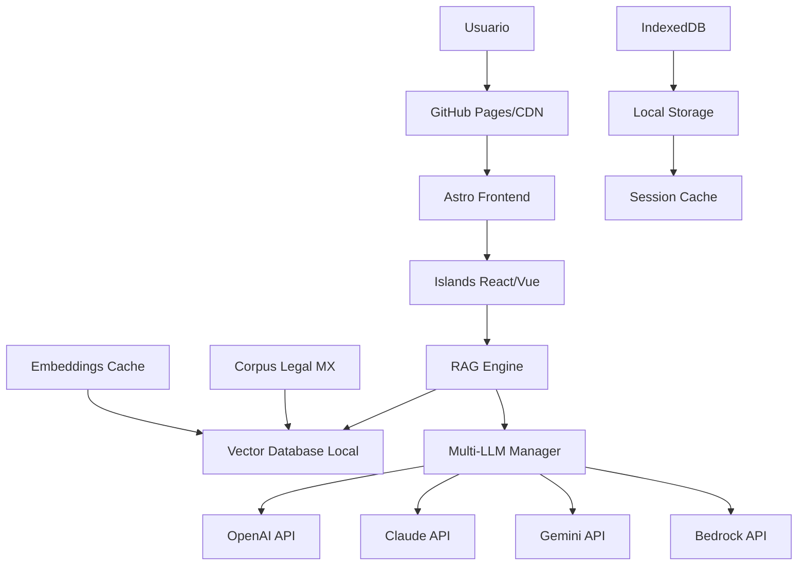

# Arquitectura Técnica LexMX - Sistema RAG Legal con Astro

## Resumen ejecutivo

LexMX utiliza Astro como framework principal con Islands Architecture para crear un asistente legal mexicano 100% estático, optimizado para GitHub Pages. La arquitectura combina contenido estático pre-renderizado con componentes interactivos bajo demanda, implementando RAG (Retrieval Augmented Generation) sin backend para consultas legales inteligentes.

## 1. ARQUITECTURA GENERAL

### Stack tecnológico principal



### Componentes fundamentales

```typescript
// Core Architecture Interface
interface LexMXArchitecture {
  frontend: AstroFramework;
  islands: ReactIslands[];
  storage: LocalStorageStrategy;
  rag: RAGEngineConfig;
  security: SecurityLayer;
  apis: LLMProviders[];
}

interface AstroFramework {
  version: "^4.0.0";
  output: "static";
  islands: true;
  integrations: ["react", "tailwind", "sitemap", "compress"];
}
```

## 2. ESTRUCTURA DEL PROYECTO

### Organización optimizada de archivos

```
lexmx/
├── astro.config.mjs              # Configuración principal
├── src/
│   ├── pages/                    # Rutas estáticas
│   │   ├── index.astro          # Landing page
│   │   ├── chat.astro           # Interfaz principal de chat
│   │   ├── legal/               # Páginas de códigos legales
│   │   │   ├── [codigo].astro   # Páginas dinámicas por código
│   │   │   └── constitucion.astro
│   │   ├── api/                 # Endpoints estáticos (JSON)
│   │   │   ├── legal-docs.json.js
│   │   │   └── embeddings.json.js
│   │   └── configuracion/
│   │       ├── tokens.astro     # Gestión de API tokens
│   │       └── preferencias.astro
│   ├── components/              # Componentes Astro (estáticos)
│   │   ├── layout/
│   │   │   ├── BaseLayout.astro
│   │   │   ├── Header.astro
│   │   │   └── Footer.astro
│   │   ├── legal/
│   │   │   ├── LegalCodeViewer.astro
│   │   │   ├── ArticleDisplay.astro
│   │   │   └── ReferenceLinks.astro
│   │   └── ui/
│   │       ├── Button.astro
│   │       ├── Card.astro
│   │       └── Alert.astro
│   ├── islands/                 # Componentes interactivos
│   │   ├── ChatInterface.tsx    # Motor de chat principal
│   │   ├── RAGEngine.tsx        # Sistema RAG
│   │   ├── TokenManager.tsx     # Gestión de tokens API
│   │   ├── DocumentUploader.tsx # Subida de documentos
│   │   ├── LegalSearch.tsx      # Búsqueda híbrida
│   │   └── PreferencesPanel.tsx # Configuraciones usuario
│   ├── lib/                     # Lógica de negocio
│   │   ├── rag/
│   │   │   ├── engine.ts        # Motor RAG principal
│   │   │   ├── vectorizer.ts    # Vectorización de documentos
│   │   │   ├── retriever.ts     # Sistema de recuperación
│   │   │   └── ranker.ts        # Ranking de resultados
│   │   ├── llm/
│   │   │   ├── manager.ts       # Gestor multi-LLM
│   │   │   ├── providers/       # Conectores API
│   │   │   │   ├── openai.ts
│   │   │   │   ├── claude.ts
│   │   │   │   ├── gemini.ts
│   │   │   │   └── bedrock.ts
│   │   │   └── optimizer.ts     # Optimización de tokens
│   │   ├── legal/
│   │   │   ├── processor.ts     # Procesamiento legal
│   │   │   ├── chunker.ts       # Chunking de documentos
│   │   │   ├── classifier.ts    # Clasificación de consultas
│   │   │   └── validator.ts     # Validación legal
│   │   ├── storage/
│   │   │   ├── indexed-db.ts    # IndexedDB wrapper
│   │   │   ├── cache.ts         # Sistema de cache
│   │   │   └── security.ts      # Encriptación local
│   │   └── utils/
│   │       ├── constants.ts     # Constantes del sistema
│   │       ├── helpers.ts       # Funciones auxiliares
│   │       └── types.ts         # Definiciones TypeScript
│   ├── data/                    # Datos estáticos
│   │   ├── legal-corpus/        # Corpus legal mexicano
│   │   │   ├── federal/
│   │   │   │   ├── constitucion.json
│   │   │   │   ├── codigo-civil.json
│   │   │   │   ├── codigo-penal.json
│   │   │   │   └── ley-amparo.json
│   │   │   ├── códigos/
│   │   │   │   ├── comercio.json
│   │   │   │   └── fiscal.json
│   │   │   ├── jurisprudencia/
│   │   │   │   ├── scjn-tesis.json
│   │   │   │   └── criterios.json
│   │   │   └── reglamentos/
│   │   ├── embeddings/          # Vectores precomputados
│   │   │   ├── core-embeddings.bin
│   │   │   ├── jurisprudencia-embeddings.bin
│   │   │   └── metadata.json
│   │   ├── templates/           # Plantillas legales
│   │   │   ├── contratos/
│   │   │   ├── demandas/
│   │   │   └── recursos/
│   │   └── configs/             # Configuraciones
│   │       ├── legal-areas.json
│   │       ├── search-weights.json
│   │       └── prompt-templates.json
│   ├── styles/                  # Estilos globales
│   │   ├── global.css
│   │   └── legal-components.css
│   └── workers/                 # Web Workers
│       ├── rag-worker.ts        # Procesamiento RAG en background
│       ├── embedding-worker.ts  # Generación de embeddings
│       └── cache-worker.ts      # Gestión de cache
├── public/                      # Assets estáticos
│   ├── legal-docs/             # Documentos públicos
│   ├── icons/                  # Iconografía legal
│   ├── fonts/                  # Tipografías
│   └── sw.js                   # Service Worker
├── scripts/                    # Scripts de build
│   ├── build-corpus.js         # Construcción del corpus
│   ├── generate-embeddings.js  # Generación de vectores
│   └── optimize-assets.js      # Optimización de assets
└── tests/                      # Testing
    ├── unit/
    ├── integration/
    └── e2e/
```

## 3. ISLANDS ARCHITECTURE PARA RAG LEGAL

### Estrategia de hidratación selectiva

```astro
---
// pages/chat.astro - Página principal de chat
import BaseLayout from '../components/layout/BaseLayout.astro';
import LegalCodeViewer from '../components/legal/LegalCodeViewer.astro';
import ChatInterface from '../islands/ChatInterface.tsx';
import TokenManager from '../islands/TokenManager.tsx';

// Pre-carga de datos críticos en build time
const popularQueries = await import('../data/configs/popular-queries.json');
const legalAreas = await import('../data/configs/legal-areas.json');
---

<BaseLayout title="LexMX - Chat Legal">
  <!-- Contenido estático - 0 JavaScript -->
  <aside class="legal-reference">
    <LegalCodeViewer />
  </aside>

  <!-- Componentes interactivos con carga estratégica -->
  <main class="chat-container">
    <!-- Configuración de tokens - Solo si no están configurados -->
    <TokenManager client:idle />
    
    <!-- Chat principal - Carga cuando sea visible -->
    <ChatInterface 
      client:visible
      popularQueries={popularQueries}
      legalAreas={legalAreas}
    />
  </main>
</BaseLayout>
```

### Componente RAG Engine principal

```tsx
// islands/ChatInterface.tsx
import React, { useState, useEffect, useRef } from 'react';
import { RAGEngine } from '../lib/rag/engine';
import { MultiLLMManager } from '../lib/llm/manager';
import { LegalQueryClassifier } from '../lib/legal/classifier';

interface ChatInterfaceProps {
  popularQueries: any[];
  legalAreas: any[];
}

export default function ChatInterface({ popularQueries, legalAreas }: ChatInterfaceProps) {
  const [ragEngine, setRAGEngine] = useState<RAGEngine | null>(null);
  const [messages, setMessages] = useState<Message[]>([]);
  const [loading, setLoading] = useState(false);
  const [initialized, setInitialized] = useState(false);

  // Inicialización lazy del sistema RAG
  useEffect(() => {
    const initializeRAG = async () => {
      if (initialized) return;

      try {
        // 1. Inicializar motor RAG
        const engine = new RAGEngine({
          corpusPath: '/legal-corpus/',
          embeddingsPath: '/embeddings/',
          chunkSize: 512,
          chunkOverlap: 50
        });

        // 2. Cargar documentos core
        await engine.loadCoreDocuments([
          'constitucion',
          'codigo-civil',
          'codigo-penal'
        ]);

        // 3. Configurar LLM manager
        const llmManager = new MultiLLMManager();
        await llmManager.initialize();
        engine.setLLMManager(llmManager);

        setRAGEngine(engine);
        setInitialized(true);

        // 4. Pre-calentar cache con consultas populares
        await engine.warmupCache(popularQueries.slice(0, 5));

      } catch (error) {
        console.error('Error inicializando RAG:', error);
      }
    };

    // Inicializar cuando el usuario hace scroll o click
    const initOnInteraction = () => {
      initializeRAG();
      window.removeEventListener('scroll', initOnInteraction);
      window.removeEventListener('click', initOnInteraction);
    };

    window.addEventListener('scroll', initOnInteraction, { once: true });
    window.addEventListener('click', initOnInteraction, { once: true });

    return () => {
      window.removeEventListener('scroll', initOnInteraction);
      window.removeEventListener('click', initOnInteraction);
    };
  }, [initialized, popularQueries]);

  const handleLegalQuery = async (query: string) => {
    if (!ragEngine) {
      // Inicialización inmediata si el usuario hace una consulta
      await initializeRAG();
    }

    setLoading(true);

    try {
      // 1. Clasificar tipo de consulta legal
      const queryType = LegalQueryClassifier.classify(query);
      
      // 2. Procesar con RAG
      const response = await ragEngine!.processLegalQuery(query, {
        queryType,
        maxResults: 5,
        includeReferences: true,
        legalArea: detectLegalArea(query, legalAreas)
      });

      // 3. Actualizar mensajes
      setMessages(prev => [
        ...prev,
        { role: 'user', content: query },
        { role: 'assistant', content: response.answer, sources: response.sources }
      ]);

    } catch (error) {
      console.error('Error procesando consulta:', error);
      // Manejo de errores con fallback
    } finally {
      setLoading(false);
    }
  };

  return (
    <div className="chat-interface">
      {/* Consultas rápidas */}
      <div className="quick-queries">
        {popularQueries.map((query, idx) => (
          <button
            key={idx}
            onClick={() => handleLegalQuery(query.text)}
            className="quick-query-btn"
          >
            {query.title}
          </button>
        ))}
      </div>

      {/* Área de mensajes */}
      <div className="messages-container">
        {messages.map((message, idx) => (
          <MessageBubble key={idx} message={message} />
        ))}
        {loading && <LoadingIndicator />}
      </div>

      {/* Input de consulta */}
      <ChatInput 
        onSubmit={handleLegalQuery}
        disabled={loading}
        placeholder="Haz tu consulta legal aquí..."
      />
    </div>
  );
}
```

## 4. MOTOR RAG OPTIMIZADO PARA LEGISLACIÓN MEXICANA

### Arquitectura del sistema RAG

```typescript
// lib/rag/engine.ts
export class RAGEngine {
  private vectorStore: VectorStore;
  private retriever: LegalRetriever;
  private llmManager: MultiLLMManager;
  private cache: RAGCache;

  constructor(config: RAGConfig) {
    this.vectorStore = new IndexedDBVectorStore(config.embeddingsPath);
    this.retriever = new LegalRetriever(config);
    this.cache = new RAGCache();
  }

  async processLegalQuery(query: string, options: QueryOptions): Promise<RAGResponse> {
    // 1. Verificar cache
    const cachedResponse = await this.cache.get(query);
    if (cachedResponse && !options.forceRefresh) {
      return cachedResponse;
    }

    // 2. Análisis y preprocesamiento de consulta
    const processedQuery = await this.preprocessLegalQuery(query, options);

    // 3. Recuperación de documentos relevantes
    const relevantDocs = await this.retriever.retrieve(processedQuery, {
      topK: options.maxResults || 5,
      scoreThreshold: 0.7,
      legalArea: options.legalArea
    });

    // 4. Re-ranking contextual
    const rankedDocs = await this.rerank(relevantDocs, processedQuery);

    // 5. Generación de respuesta
    const response = await this.generateResponse(processedQuery, rankedDocs, options);

    // 6. Cache del resultado
    await this.cache.set(query, response);

    return response;
  }

  private async preprocessLegalQuery(query: string, options: QueryOptions): Promise<ProcessedQuery> {
    return {
      originalQuery: query,
      normalizedQuery: this.normalizeQuery(query),
      queryType: LegalQueryClassifier.classify(query),
      extractedEntities: await this.extractLegalEntities(query),
      intent: await this.detectIntent(query),
      legalArea: options.legalArea || this.detectLegalArea(query)
    };
  }

  private async generateResponse(
    query: ProcessedQuery, 
    documents: RankedDocument[], 
    options: QueryOptions
  ): Promise<RAGResponse> {
    // Construcción del contexto legal
    const legalContext = this.buildLegalContext(documents);
    
    // Selección del prompt template basado en tipo de consulta
    const promptTemplate = this.selectPromptTemplate(query.queryType);
    
    // Generación con LLM optimizado
    const response = await this.llmManager.generate({
      prompt: promptTemplate.format(query, legalContext),
      temperature: 0.1, // Respuestas consistentes para cache
      maxTokens: this.calculateOptimalTokens(query),
      model: this.selectOptimalModel(query.queryType)
    });

    return {
      answer: response.text,
      sources: documents.map(doc => ({
        title: doc.metadata.title,
        article: doc.metadata.article,
        relevanceScore: doc.score,
        url: doc.metadata.url
      })),
      confidence: response.confidence,
      queryType: query.queryType,
      processingTime: response.processingTime
    };
  }
}
```

### Sistema de recuperación híbrida

```typescript
// lib/rag/retriever.ts
export class LegalRetriever {
  private keywordSearch: BM25Search;
  private semanticSearch: VectorSearch;
  private legalIndex: LegalDocumentIndex;

  async retrieve(query: ProcessedQuery, options: RetrievalOptions): Promise<Document[]> {
    // Búsqueda paralela
    const [keywordResults, semanticResults] = await Promise.all([
      this.keywordSearch.search(query.normalizedQuery, {
        boost: this.getKeywordBoost(query.queryType),
        fields: ['title', 'content', 'articles']
      }),
      this.semanticSearch.search(await this.getQueryEmbedding(query.originalQuery), {
        topK: options.topK * 2, // Sobre-recuperar para fusión
        filter: this.buildLegalFilter(query.legalArea)
      })
    ]);

    // Fusión de resultados con Reciprocal Rank Fusion
    const fusedResults = this.fuseResults(keywordResults, semanticResults, query);

    // Filtrado específico para consultas legales
    return this.applyLegalFilters(fusedResults, query, options);
  }

  private fuseResults(
    keywordResults: SearchResult[], 
    semanticResults: SearchResult[], 
    query: ProcessedQuery
  ): Document[] {
    const scoreMap = new Map<string, number>();
    
    // RRF con pesos adaptativos basados en tipo de consulta
    const keywordWeight = this.getKeywordWeight(query.queryType);
    const semanticWeight = 1 - keywordWeight;

    // Procesar resultados de keywords
    keywordResults.forEach((result, rank) => {
      const rrfScore = keywordWeight / (60 + rank + 1);
      scoreMap.set(result.id, (scoreMap.get(result.id) || 0) + rrfScore);
    });

    // Procesar resultados semánticos
    semanticResults.forEach((result, rank) => {
      const rrfScore = semanticWeight / (60 + rank + 1);
      scoreMap.set(result.id, (scoreMap.get(result.id) || 0) + rrfScore);
    });

    // Ordenar por score fusionado
    return Array.from(scoreMap.entries())
      .sort(([, a], [, b]) => b - a)
      .map(([id, score]) => ({ 
        ...this.getDocumentById(id), 
        fusedScore: score 
      }));
  }

  private getKeywordWeight(queryType: LegalQueryType): number {
    // Pesos adaptativos basados en el tipo de consulta legal
    const weights = {
      citation: 0.8,      // "Artículo 123 constitucional"
      procedural: 0.6,    // "Cómo tramitar divorcio"
      conceptual: 0.3,    // "Qué es usucapión"
      analytical: 0.4     // "Diferencias entre dolo y culpa"
    };
    return weights[queryType] || 0.5;
  }
}
```

## 5. GESTIÓN MULTI-LLM CON OPTIMIZACIÓN DE COSTOS

### Manager inteligente de proveedores

```typescript
// lib/llm/manager.ts
export class MultiLLMManager {
  private providers: LLMProvider[];
  private costOptimizer: CostOptimizer;
  private fallbackStrategy: FallbackStrategy;

  constructor() {
    this.providers = [
      new OpenAIProvider(),
      new ClaudeProvider(),
      new GeminiProvider(),
      new BedrockProvider()
    ];
    this.costOptimizer = new CostOptimizer();
    this.fallbackStrategy = new FallbackStrategy();
  }

  async generate(request: GenerationRequest): Promise<GenerationResponse> {
    // 1. Selección óptima de proveedor
    const optimalProvider = await this.selectOptimalProvider(request);

    // 2. Optimización de prompt
    const optimizedRequest = await this.costOptimizer.optimizeRequest(request);

    try {
      // 3. Ejecución con proveedor principal
      const response = await optimalProvider.generate(optimizedRequest);
      
      // 4. Tracking de costos
      await this.trackUsage(optimalProvider, optimizedRequest, response);
      
      return response;

    } catch (error) {
      // 5. Fallback automático
      return await this.fallbackStrategy.handleError(error, optimizedRequest);
    }
  }

  private async selectOptimalProvider(request: GenerationRequest): Promise<LLMProvider> {
    const factors = {
      taskType: this.getTaskType(request),
      complexity: this.assessComplexity(request),
      budget: this.getRemainingBudget(),
      availability: await this.checkProviderAvailability()
    };

    // Matriz de decisión multi-criterio
    const scores = this.providers.map(provider => ({
      provider,
      score: this.calculateProviderScore(provider, factors)
    }));

    return scores.sort((a, b) => b.score - a.score)[0].provider;
  }

  private calculateProviderScore(provider: LLMProvider, factors: SelectionFactors): number {
    let score = 0;

    // Factor costo (40% del peso)
    const costScore = (1 - provider.getCostPerToken() / this.getMaxCostPerToken()) * 0.4;
    score += costScore;

    // Factor calidad para tarea específica (35% del peso)
    const qualityScore = provider.getQualityScore(factors.taskType) * 0.35;
    score += qualityScore;

    // Factor velocidad (15% del peso)
    const speedScore = (1 - provider.getAverageLatency() / this.getMaxLatency()) * 0.15;
    score += speedScore;

    // Factor disponibilidad (10% del peso)
    const availabilityScore = provider.getAvailability() * 0.1;
    score += availabilityScore;

    return score;
  }
}
```

### Optimizador de costos avanzado

```typescript
// lib/llm/optimizer.ts
export class CostOptimizer {
  private compressionRules: CompressionRule[];
  private tokenPredictors: TokenPredictor[];

  async optimizeRequest(request: GenerationRequest): Promise<OptimizedRequest> {
    // 1. Compresión de contexto legal
    const compressedContext = await this.compressLegalContext(request.context);

    // 2. Optimización de prompt
    const optimizedPrompt = await this.optimizePrompt(request.prompt, request.taskType);

    // 3. Predicción de tokens de salida
    const predictedOutputTokens = await this.predictOutputTokens(request);

    // 4. Ajuste de parámetros
    const optimizedParams = this.optimizeParameters(request, predictedOutputTokens);

    return {
      ...request,
      prompt: optimizedPrompt,
      context: compressedContext,
      ...optimizedParams,
      estimatedCost: this.estimateCost(optimizedPrompt, compressedContext, predictedOutputTokens)
    };
  }

  private async compressLegalContext(context: LegalContext[]): Promise<string> {
    // Técnicas de compresión específicas para contenido legal
    const compressed = context.map(item => {
      // Mantener estructura legal crítica
      if (item.type === 'article') {
        return `Art. ${item.number}: ${this.compressText(item.content, 0.7)}`;
      }
      
      // Comprimir jurisprudencia manteniendo ratio legal
      if (item.type === 'jurisprudence') {
        return `Tesis ${item.number}: ${this.compressText(item.content, 0.6)}`;
      }

      return this.compressText(item.content, 0.5);
    });

    return compressed.join('\n\n');
  }

  private compressText(text: string, compressionRatio: number): string {
    // Implementación de compresión que preserva términos legales
    const legalTerms = this.extractLegalTerms(text);
    const compressedText = this.applyLinguisticCompression(text, compressionRatio);
    
    // Asegurar que términos legales críticos se mantienen
    return this.restoreLegalTerms(compressedText, legalTerms);
  }
}
```

## 6. ALMACENAMIENTO Y CACHE INTELIGENTE

### Sistema de almacenamiento híbrido

```typescript
// lib/storage/hybrid-storage.ts
export class HybridStorage {
  private indexedDB: IndexedDBManager;
  private localStorage: LocalStorageManager;
  private sessionStorage: SessionStorageManager;
  private cache: InMemoryCache;

  constructor() {
    this.indexedDB = new IndexedDBManager('lexmx-legal', 2);
    this.localStorage = new LocalStorageManager();
    this.sessionStorage = new SessionStorageManager();
    this.cache = new InMemoryCache({ maxSize: 50_000_000 }); // 50MB
  }

  async initialize(): Promise<void> {
    await this.indexedDB.initialize({
      stores: [
        { name: 'legal_documents', keyPath: 'id', indexes: ['type', 'lastUpdated'] },
        { name: 'embeddings', keyPath: 'documentId' },
        { name: 'query_cache', keyPath: 'hash', indexes: ['timestamp'] },
        { name: 'user_preferences', keyPath: 'key' }
      ]
    });
  }

  async storeLegalDocument(document: LegalDocument): Promise<void> {
    // Decisión inteligente de almacenamiento basada en tamaño y uso
    if (document.size > 1_000_000) { // >1MB
      await this.indexedDB.store('legal_documents', document);
    } else if (document.frequency === 'high') {
      await this.cache.set(`doc_${document.id}`, document);
      await this.localStorage.setItem(`doc_${document.id}`, document);
    } else {
      await this.sessionStorage.setItem(`doc_${document.id}`, document);
    }
  }

  async getLegalDocument(id: string): Promise<LegalDocument | null> {
    // Estrategia de recuperación en cascada
    
    // 1. Memoria (más rápido)
    let document = await this.cache.get(`doc_${id}`);
    if (document) return document;

    // 2. Session Storage
    document = await this.sessionStorage.getItem(`doc_${id}`);
    if (document) {
      this.cache.set(`doc_${id}`, document); // Promover a cache
      return document;
    }

    // 3. Local Storage
    document = await this.localStorage.getItem(`doc_${id}`);
    if (document) {
      this.cache.set(`doc_${id}`, document);
      return document;
    }

    // 4. IndexedDB (para documentos grandes)
    document = await this.indexedDB.get('legal_documents', id);
    if (document) {
      // Solo promover a cache en memoria si es frecuentemente usado
      if (document.frequency === 'high') {
        this.cache.set(`doc_${id}`, document);
      }
      return document;
    }

    return null;
  }
}
```

### Cache inteligente de respuestas RAG

```typescript
// lib/storage/rag-cache.ts
export class RAGCache {
  private storage: HybridStorage;
  private semanticIndex: SemanticIndex;

  async get(query: string): Promise<RAGResponse | null> {
    // 1. Cache exacto
    const exactHash = this.hashQuery(query);
    let cached = await this.storage.indexedDB.get('query_cache', exactHash);
    if (cached && !this.isExpired(cached)) {
      return cached.response;
    }

    // 2. Cache semántico (consultas similares)
    const semanticMatch = await this.findSemanticMatch(query, 0.95);
    if (semanticMatch) {
      return semanticMatch.response;
    }

    return null;
  }

  async set(query: string, response: RAGResponse): Promise<void> {
    const hash = this.hashQuery(query);
    const cacheEntry = {
      hash,
      query,
      response,
      timestamp: Date.now(),
      embedding: await this.getQueryEmbedding(query),
      usage_count: 1
    };

    // Almacenar en IndexedDB
    await this.storage.indexedDB.store('query_cache', cacheEntry);

    // Actualizar índice semántico
    await this.semanticIndex.add(hash, cacheEntry.embedding);

    // Limpieza periódica
    if (Math.random() < 0.01) { // 1% de probabilidad
      await this.cleanup();
    }
  }

  private async findSemanticMatch(query: string, threshold: number): Promise<CacheEntry | null> {
    const queryEmbedding = await this.getQueryEmbedding(query);
    const similar = await this.semanticIndex.search(queryEmbedding, 1, threshold);
    
    if (similar.length > 0) {
      const match = await this.storage.indexedDB.get('query_cache', similar[0].id);
      if (match && !this.isExpired(match)) {
        // Incrementar contador de uso
        match.usage_count++;
        await this.storage.indexedDB.store('query_cache', match);
        return match;
      }
    }

    return null;
  }

  private async cleanup(): Promise<void> {
    // Limpiar entradas expiradas y poco usadas
    const cutoffTime = Date.now() - (24 * 60 * 60 * 1000); // 24 horas
    
    await this.storage.indexedDB.deleteWhere('query_cache', entry => 
      entry.timestamp < cutoffTime && entry.usage_count < 2
    );
  }
}
```

## 7. SEGURIDAD Y MANEJO DE TOKENS

### Gestión segura de tokens API

```typescript
// lib/security/token-manager.ts
export class SecureTokenManager {
  private encryptionKey: CryptoKey | null = null;
  private providers: Map<string, TokenConfig> = new Map();

  async initialize(masterPassword?: string): Promise<void> {
    // Generar clave de encriptación derivada del contexto del usuario
    this.encryptionKey = await this.deriveEncryptionKey(masterPassword);
    
    // Cargar tokens existentes
    await this.loadStoredTokens();
  }

  async storeToken(provider: LLMProvider, token: string): Promise<void> {
    // Validar formato del token
    await this.validateTokenFormat(provider, token);

    // Encriptar token
    const encryptedToken = await this.encryptToken(token);

    // Almacenar de forma segura
    const tokenConfig = {
      provider: provider.name,
      encryptedToken,
      createdAt: Date.now(),
      lastUsed: Date.now(),
      isValid: true
    };

    // Almacenar en SessionStorage por defecto (más seguro)
    sessionStorage.setItem(`lexmx_token_${provider.name}`, JSON.stringify(tokenConfig));
    
    this.providers.set(provider.name, tokenConfig);
  }

  async getToken(providerName: string): Promise<string | null> {
    const config = this.providers.get(providerName);
    if (!config || !config.isValid) {
      return null;
    }

    try {
      const decryptedToken = await this.decryptToken(config.encryptedToken);
      
      // Actualizar último uso
      config.lastUsed = Date.now();
      sessionStorage.setItem(`lexmx_token_${providerName}`, JSON.stringify(config));
      
      return decryptedToken;
    } catch (error) {
      console.error('Error decrypting token:', error);
      await this.invalidateToken(providerName);
      return null;
    }
  }

  private async encryptToken(token: string): Promise<EncryptedData> {
    if (!this.encryptionKey) {
      throw new Error('Encryption key not initialized');
    }

    const iv = crypto.getRandomValues(new Uint8Array(12));
    const encodedToken = new TextEncoder().encode(token);
    
    const encrypted = await crypto.subtle.encrypt(
      { name: 'AES-GCM', iv },
      this.encryptionKey,
      encodedToken
    );

    return {
      data: Array.from(new Uint8Array(encrypted)),
      iv: Array.from(iv)
    };
  }

  private async deriveEncryptionKey(masterPassword?: string): Promise<CryptoKey> {
    // Usar fingerprinting del navegador como semilla base
    const fingerprint = await this.generateBrowserFingerprint();
    
    // Combinar con contraseña del usuario si se proporciona
    const keyMaterial = masterPassword ? 
      `${fingerprint}-${masterPassword}` : 
      fingerprint;

    const keyMaterialBuffer = new TextEncoder().encode(keyMaterial);
    
    // Importar material de clave
    const importedKey = await crypto.subtle.importKey(
      'raw',
      keyMaterialBuffer,
      'PBKDF2',
      false,
      ['deriveKey']
    );

    // Derivar clave AES
    return await crypto.subtle.deriveKey(
      {
        name: 'PBKDF2',
        salt: new TextEncoder().encode('lexmx-legal-assistant'),
        iterations: 100000,
        hash: 'SHA-256'
      },
      importedKey,
      { name: 'AES-GCM', length: 256 },
      false,
      ['encrypt', 'decrypt']
    );
  }
}
```

## 8. CONFIGURACIÓN DE DEPLOYMENT

### Configuración Astro optimizada para GitHub Pages

```javascript
// astro.config.mjs
import { defineConfig } from 'astro/config';
import react from '@astrojs/react';
import tailwind from '@astrojs/tailwind';
import sitemap from '@astrojs/sitemap';
import compress from 'astro-compress';

export default defineConfig({
  site: 'https://tu-usuario.github.io',
  base: '/lexmx',
  output: 'static',
  
  integrations: [
    react(),
    tailwind(),
    sitemap(),
    compress({
      css: true,
      html: true,
      img: true,
      js: true,
      svg: true
    })
  ],

  vite: {
    build: {
      rollupOptions: {
        output: {
          manualChunks: {
            // Separar chunks por funcionalidad
            'legal-corpus': ['./src/data/legal-corpus/constitucion.json'],
            'rag-engine': ['./src/lib/rag/engine.ts'],
            'llm-providers': ['./src/lib/llm/providers/openai.ts', './src/lib/llm/providers/claude.ts'],
            'vector-search': ['./src/lib/rag/vectorizer.ts', './src/lib/rag/retriever.ts']
          }
        }
      },
      chunkSizeWarningLimit: 1000,
      target: 'esnext'
    },
    optimizeDeps: {
      include: ['react', 'react-dom']
    }
  },

  // Optimizaciones específicas para documentos legales
  markdown: {
    shikiConfig: {
      theme: 'github-light',
      wrap: true
    }
  },

  experimental: {
    assets: true,
    viewTransitions: true
  }
});
```

### GitHub Actions para deployment automático

```yaml
# .github/workflows/deploy.yml
name: Deploy LexMX to GitHub Pages

on:
  push:
    branches: [main]
  pull_request:
    branches: [main]

permissions:
  contents: read
  pages: write
  id-token: write

concurrency:
  group: "pages"
  cancel-in-progress: false

jobs:
  build:
    runs-on: ubuntu-latest
    steps:
      - name: Checkout
        uses: actions/checkout@v4

      - name: Setup Node.js
        uses: actions/setup-node@v4
        with:
          node-version: '18'
          cache: 'npm'

      - name: Install dependencies
        run: npm ci

      - name: Build legal corpus
        run: npm run build:corpus

      - name: Generate embeddings
        run: npm run build:embeddings
        env:
          OPENAI_API_KEY: ${{ secrets.OPENAI_API_KEY }}

      - name: Build Astro site
        run: npm run build

      - name: Upload artifact
        uses: actions/upload-pages-artifact@v2
        with:
          path: ./dist

  deploy:
    environment:
      name: github-pages
      url: ${{ steps.deployment.outputs.page_url }}
    runs-on: ubuntu-latest
    needs: build
    steps:
      - name: Deploy to GitHub Pages
        id: deployment
        uses: actions/deploy-pages@v2
```

## 9. MÉTRICAS Y MONITOREO

### Sistema de analytics integrado

```typescript
// lib/analytics/performance-monitor.ts
export class PerformanceMonitor {
  private metrics: Map<string, Metric[]> = new Map();

  trackRAGQuery(query: string, response: RAGResponse, processingTime: number): void {
    const metric = {
      timestamp: Date.now(),
      queryType: response.queryType,
      processingTime,
      confidence: response.confidence,
      sourcesRetrieved: response.sources.length,
      cacheHit: response.fromCache || false,
      cost: response.estimatedCost || 0
    };

    this.addMetric('rag_queries', metric);
    
    // Envío opcional a analytics (respetando privacidad)
    if (this.userConsentedToAnalytics()) {
      this.sendAnonymizedMetric(metric);
    }
  }

  getPerformanceReport(): PerformanceReport {
    return {
      averageResponseTime: this.getAverageResponseTime(),
      cacheHitRate: this.getCacheHitRate(),
      totalCostSavings: this.getTotalCostSavings(),
      queryDistribution: this.getQueryTypeDistribution(),
      userSatisfaction: this.getUserSatisfactionScore()
    };
  }
}
```

## 10. ESCALABILIDAD Y MANTENIMIENTO

### Estrategia de actualización de corpus legal

```typescript
// scripts/update-legal-corpus.ts
class LegalCorpusUpdater {
  async checkForUpdates(): Promise<UpdateSummary> {
    // Verificar actualizaciones en fuentes oficiales
    const sources = [
      'https://www.diputados.gob.mx/LeyesBiblio/',
      'https://dof.gob.mx/',
      'https://sjf.scjn.gob.mx/'
    ];

    const updates = await Promise.all(
      sources.map(source => this.checkSource(source))
    );

    return {
      totalUpdates: updates.reduce((sum, update) => sum + update.count, 0),
      criticalUpdates: updates.filter(u => u.priority === 'critical'),
      scheduledUpdate: this.calculateUpdateSchedule(updates)
    };
  }

  async updateCorpus(updates: LegalUpdate[]): Promise<void> {
    for (const update of updates) {
      // 1. Descargar documento actualizado
      const document = await this.downloadDocument(update.url);
      
      // 2. Procesar y chunkear
      const chunks = await this.processLegalDocument(document);
      
      // 3. Generar embeddings
      const embeddings = await this.generateEmbeddings(chunks);
      
      // 4. Actualizar índices
      await this.updateVectorIndex(update.documentId, embeddings);
      
      // 5. Invalidar cache relacionado
      await this.invalidateRelatedCache(update.documentId);
    }
  }
}
```

Esta arquitectura técnica proporciona una base sólida y escalable para LexMX, aprovechando las fortalezas de Astro para crear un asistente legal mexicano eficiente, seguro y optimizado para costos.